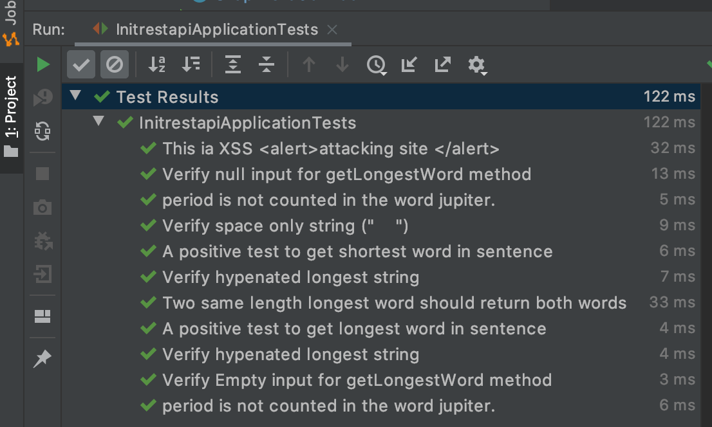

# Runing instruction 
Test uses springboottest mockito and JUnit 5 to test business logic in service layer `clean test` 
Run application on port:2303 `clean spring-boot:run` and hit following end point 
`http://localhost:2303/longword?sentence=The cow jumped over the moon.` 

# Solution 
User/System can provide the "Sentence" and solution need to find the longest or the shortest word & its length from input

## Requirements
1. Input can come from following sources 
     Parameter in URL  
     Command line argument  
     Json, xml  
     Excel , csv, flatfiles  
     Some kind of Stream -Kafka, kinesis, other apis etc.  
     Database  
     ...     
2. User/System can send sentence in different language so solution need to be compatible with char encoding   
3. Case-sestivity should be defined by user/system as parameter. By default, It will be case-senstive in this solution.  
4. All same length longest words will be returned by solution   
5. Apart from " " , other charachter will not be part of word. Exception is "." period chars.  
6. Escape-Sequence will be treated as the literal but removed from computation.These char can pose security risk. It should be handled on front-end layer instead of service layer. Solution will remove these char during computation  

N.B. The above points are assumptions. Due to time constraint, I have implemeted few tests as depicts in next sections    

# Steps performed
Initialize the project via spring starter https://start.spring.io/  
dryrun get api endpoint`/longword?sentence=x` without logic e.g. 
`http://localhost:2303/longword?sentence=This is SpringBoot application`  

Created following TestCases

## TDD Approach - Junit-5, Springboottest , Mockito 
    Test-1: getLongestWordWithLength() , A positive test to get longest word in sentence
    { The cow jumped over the moon. : jumped }
    
    Test-2 getShortestWordWithLength() , A positive test to get shortest word in sentence
     { The cow jumped over moon. : The }
     
    Test-3: manageNullSentence() , Verify null input for getLongestWord method
    { Please provide the non-null Input : 0 }  
    
    Test-4: manageEmptySentence() , Verify Empty input for getLongestWord method
    { Please provide the non-empty Input : 0 }
    
    Test-5: multipleLargestWordsInSentence() , Two same length longest word should return both words
    { The monkey and cow and jumped over the moon  : monkey, 6 ; jumped , 6}
    
    Test-6: sendOnlySpaceInSentence() , Verify space only string ("    ")
    { You have wrongly provided space-only input: 0}
            
    Test-6: hypenatedLongedWordInSentence() , Verify hypenated longest string
    { the worst in-a-recession year. : 14}
    
    Test-7: onlyhypenatedLongedWordInSentence() , Verify hypenated longest string
    { the-worst-in-a-recession-year. : 29}
    
    Test-8: periodCharNotCountedInWord , Period is not counted in the word jupiter.
    { The cow jumped over the jupiter. : 7}
    
    Test-9: otheLanguageWordInSentence , Find word in other language.
    { इंगलैंड कोरोना से लड़ाई जीतेग。: 7}
    
     Test-10: escapeSequenceInTheSentence , This ia XSS <alert>attacking site </alert>
     { alert : 5}

# Result

     
    

